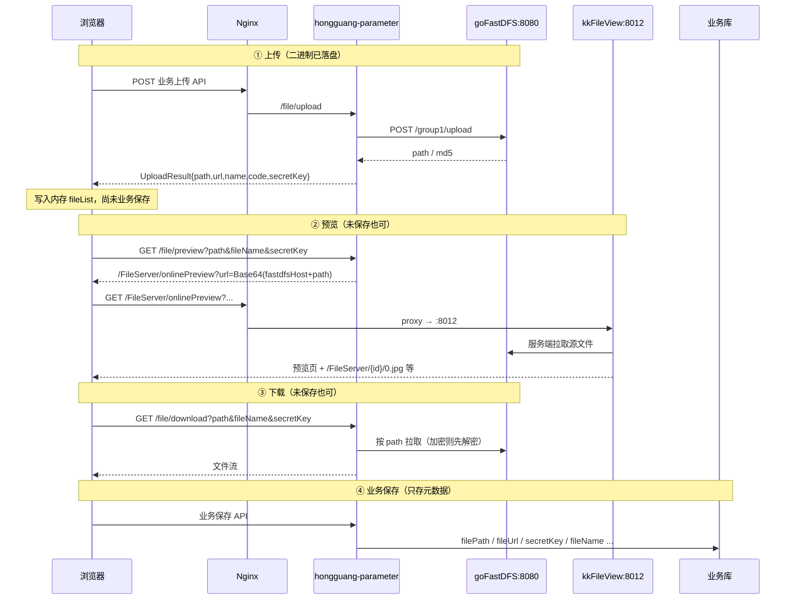

本文整理 **hongguang（虹光铸造全生命周期管理系统）** 中附件上传、在线预览、下载的完整数据流，以及局域网 / 公网双入口下 PDF 灰屏等问题的排查与配置方案。涉及前端附件组件、`hongguang-parameter`、goFastDFS、kkFileView、Nginx。

> **适用读者**：实施、运维、全栈开发。  
> **前置知识**：了解项目基本架构（Nginx + Gateway + Nacos + 微服务），可参考 [虹光项目：服务器部署架构与从零搭建指南](/2026/05/29/虹光项目：服务器部署架构与从零搭建指南/)、[kkFileView 文件在线预览服务入门指南](/2026/06/16/kkFileView文件在线预览服务入门指南/)。  
> **环境**：局域网 `192.168.1.100`，公网 `<PUBLIC_IP>:8001`。

---

## 目录

1. [组件职责一览](#1-组件职责一览)
2. [数据流通链路（按路径）](#2-数据流通链路按路径)
3. [各格式预览分别要什么](#3-各格式预览分别要什么)
4. [遇到的问题与解决方案](#4-遇到的问题与解决方案)
5. [配置与 Nginx 参考片段](#5-配置与-nginx-参考片段)
6. [验证清单](#6-验证清单)
7. [相关代码位置](#7-相关代码位置便于对照)
8. [一句话总结](#8-一句话总结)

---

## 1. 组件职责一览

| 组件 | 职责 | 典型地址 |
|------|------|----------|
| 前端 `FileUpload` | 上传、持有未保存元数据、发起预览/下载 | 业务站点 |
| `hongguang-parameter` | 上传转发、拼预览 URL、代下载 | `/hongguang-parameter/file/*` |
| goFastDFS | 文件二进制存储 | `http://192.168.1.100:8080`（内网） |
| kkFileView | 在线预览（TXT 直渲 / PDF·Office 转图等） | 内网 `8012`，对外经 `/FileServer/` |
| Nginx | 反代前端、API、`/group1/`、`/FileServer/` | 局域网 `:80`、公网 `:8001` |

### 关键配置

| 配置项 | 位置 | 作用 | 推荐值（双入口） |
|--------|------|------|------------------|
| `spring.fastdfs-host` | Nacos | 后端/kkFileView **服务端**访问 goFastDFS 的根地址 | `http://192.168.1.100:8080`（保持内网） |
| `base.url` | kkFileView `application.properties` | 拼预览页内资源（如 `0.jpg`）的对外根路径 | `/FileServer`（相对路径） |
| `previewPage` / `previewDecodePage` | 系统默认参数 | 预览入口页 | `/FileServer/onlinePreview` |
| Nginx `/group1/` | Nginx | 浏览器侧访问存储文件 | 反代到 `192.168.1.100:8080/group1/` |
| Nginx `/FileServer/` | Nginx | 浏览器侧访问预览服务 | 反代到 `127.0.0.1:8012/` |

---

## 2. 数据流通链路（按路径）

### 2.1 总览时序



### 2.2 上传路径流转

```
浏览器
  → POST {网关}/hongguang-parameter/file/upload
       (multipart, isSecret, scene 可选)
  → FileServiceImpl
       ├─ isSecret=true：本地加密，生成 secretKey
       └─ HTTP POST {fastdfs-host}/group1/upload
            scene=default|temp|large, output=json
  → goFastDFS 落盘
  → 返回 UploadResult：
       path = /group1/default/yyyyMMdd/.../xxx.ext
       url  = fastdfs-host + path
       name / code(md5) / secretKey?
  → 前端映射进 fileList：
       filePath←path, fileUrl←url, fileName←name,
       fileCode←code, secretKey←secretKey
```

**要点：** 上传成功即表示文件已在 goFastDFS；业务「保存」前不写附件业务表，预览/下载靠前端内存中的 `path` / `secretKey` / `fileName`。

### 2.3 预览路径流转（未保存 / 已保存共用拼 URL 方式）

```
浏览器（内存或库中的 path）
  → GET /hongguang-parameter/file/preview
       ?path=&fileName=&secretKey=
  → FileUploadUtils.preview：
       1) realUrl = fastdfs-host + path
          例：http://192.168.1.100:8080/group1/default/.../a.pdf
       2) encodeUrl = Base64.urlSafe(realUrl)
       3) 读系统参数 previewPage（相对化后默认 /FileServer/onlinePreview）
       4) 返回：
          /FileServer/onlinePreview?url={encodeUrl}&watermarkTxt=...
          （加密文件另带 key、filename，走 previewDecodePage）
  → 浏览器 window.open(相对预览地址)
  → Nginx：/FileServer/ → 127.0.0.1:8012/
  → kkFileView：
       解码 url → 服务端向 goFastDFS 拉文件
       ├─ TXT：文本渲染
       ├─ PDF（本环境）：转页图 → {id}/0.jpg, 1.jpg...
       └─ Word：依赖 LibreOffice 转 PDF/图后再预览
  → 页面内资源地址 = base.url + /{id}/0.jpg
       当 base.url=/FileServer 时：
       局域网 → http://192.168.1.100/FileServer/{id}/0.jpg
       公网   → http://<PUBLIC_IP>:8001/FileServer/{id}/0.jpg
```

**Base64 说明：** 编码的是「完整可下载 HTTP URL」，不是单独 path；Base64 仅为安全塞入查询参数，不是加密。kkFileView 必须能访问解码后的地址。

### 2.4 下载路径流转

```
浏览器
  → GET {API}/hongguang-parameter/file/download
       ?fileName=&path=&secretKey=
  → FileUploadUtils.download：
       url = fastdfs-host + path
       ├─ 非加密：HttpUtil.download(url) → response
       └─ 加密：SecureUtils.decodeUrl 后写流
  → 浏览器收到附件流
```

不依赖业务表；有 `path`（及可选 `secretKey`）即可。已保存后也可按 `fileId` 走产品附件下载接口（先查库再同样拉 DFS）。

### 2.5 业务保存路径流转

```
前端 fileList（已含 path/url/secretKey/...）
  → 业务保存 API
  → 仅持久化元数据到业务表
       （如 VcsProductFileDetail：filePath/fileUrl/secretKey/fileName/fileCode）
  → 不重新上传、不移动 goFastDFS 对象
```

| 阶段 | 二进制 | 元数据 | 预览/下载依据 |
|------|--------|--------|----------------|
| 上传成功、未保存 | 已在 goFastDFS | 仅前端 `fileList` | 内存中的 path/key |
| 业务已保存 | 同一对象 | 业务表 | 库中 path/key 或 fileId |

### 2.6 Nginx 路径映射（局域网 :80 / 公网 :8001）

```
浏览器请求                         Nginx 转发
─────────────────────────────────────────────────────────
/                         → 前端静态 dist（SPA）
/api/                     → 后端网关/API（如 :3000）
/group1/**                → http://192.168.1.100:8080/group1/
/FileServer/**            → http://127.0.0.1:8012/   （注意去掉 /FileServer 前缀）
/hongguang-parameter/**   → 经网关到 parameter 服务（以实际网关配置为准）
```

公网入口 `http://<PUBLIC_IP>:8001/` 转发到内网机时，须保证实际命中的 server 块同样具备 `/group1/`、`/FileServer/`，且浏览器地址栏的 host:port 与反代入口一致（避免「浏览器以为是 8001、实际打到 80」导致 Host/链接错乱）。

---

## 3. 各格式预览分别要什么

| 格式 | kkFileView 行为 | 额外依赖 |
|------|-----------------|----------|
| TXT | 服务端读文本直接渲染 | 注意编码（建议 UTF-8） |
| PDF | 本环境多为转 `0.jpg` 分页图（不一定走 pdf.js） | 转换与 `file.dir` 写权限；**不依赖** LibreOffice |
| Word（doc/docx） | 先转 PDF/图再预览 | LibreOffice + `office.home` + 中文字体 |

业务侧一般**不必**按后缀各写一套预览 API；统一 `/file/preview` + Base64 URL，靠扩展名分流。

kkFileView 会本地缓存转换结果（`file.dir`），默认定时清理；权威文件始终在 goFastDFS，kkFileView 不是主存储。

---

## 4. 遇到的问题与解决方案

### 问题 A：TXT 可预览，PDF 页面灰屏 / 空白，但源文件可下载

**现象**

- 打开 `/FileServer/onlinePreview?url=Base64(...)`，识别为 PDF（出现 `pdf.svg`），内容空白。
- Base64 解码后的 goFastDFS 地址可正常下载。
- 服务端已生成正确的 `0.jpg`（磁盘上打开正常）。

**排查误区**

- 「Network 里没有 `pdf.js`」**不能**当作故障依据。很多部署使用**图片预览模式**，只会请求 `0.jpg`、`1.jpg`，不会加载 `pdf.js`。

**根因**

- kkFileView 经 Nginx 挂在 `/FileServer/` 下，但 `base.url` 未带此前缀（或写死错误绝对地址）。
- 页面内图片请求变成：

```text
http://192.168.1.100/{id}/0.jpg          ← 错误（缺 /FileServer，落到 80 根路径）
```

而预览页本身是：

```text
http://192.168.1.100/FileServer/onlinePreview?...
```

磁盘有图 ≠ 浏览器请求的 URL 能打到 kkFileView。

**解决方案**

```properties
# kkFileView application.properties
base.url = /FileServer
```

重启后图片应变为：

```text
http://{当前访问Host}/FileServer/{id}/0.jpg
```

**为何可行**

- `/FileServer/` 已由 Nginx 反代到 `:8012`，相对 `base.url` 让浏览器始终用「当前站点 + /FileServer」取图。
- 转换链路（拉 PDF → 生成 `0.jpg`）本身是通的，只需修正**浏览器侧资源前缀**。

---

### 问题 B：局域网预览正常，公网同时要上传 / 下载 / 预览

**现象 / 风险**

- 局域网：`base.url = http://192.168.1.100/FileServer` 可用。
- 公网：`http://<PUBLIC_IP>:8001/` → 内网机；若 `base.url` 写死局域网 IP，公网用户加载 `0.jpg` 失败。
- 若把 `fastdfs-host` 改成公网，后端/kkFileView 服务端取文件可能失败或不稳定。

**解决方案（推荐组合）**

| 项 | 做法 |
|----|------|
| Nacos `fastdfs-host` | **保持** `http://192.168.1.100:8080`（仅服务端访问） |
| kkFileView `base.url` | **`/FileServer`**（相对路径，随访问入口变化） |
| 系统预览参数 | `/FileServer/onlinePreview`（相对路径） |
| Nginx | 局域网与公网入口均反代 `/group1/`、`/FileServer/` |
| 前端 | 优先 `/file/preview`、`/file/download`；避免公网用户直接打开 `http://192.168.1.100:8080/group1/...` 绝对直链 |

**为何可行（职责分离）**

| 谁访问 | 用什么地址 | 原因 |
|--------|------------|------|
| Java / kkFileView 拉源文件 | 内网 `fastdfs-host:8080` | 同机房稳定、不依赖公网回环 |
| 用户浏览器打开预览页与 `0.jpg` | 当前域名下的 `/FileServer/...` | 局域网、公网各自解析到可通的入口 |
| 用户经 API 下载 | 业务下载接口 → 后端再访内网 DFS | 浏览器不直连 `:8080` |

相对 `base.url` 已在该内网环境验证可用，是双入口并存的关键。

---

### 问题 C：未点业务「保存」时，预览/下载从哪来？

**结论：** 不查业务库。上传响应里的 `path` / `secretKey` / `fileName` 留在前端 `fileList`，预览拼 kkFileView URL，下载带 path 调 parameter 代拉。保存只落元数据。

---

## 5. 配置与 Nginx 参考片段

### 5.1 kkFileView

```properties
# 提供预览服务的地址；Nginx 反代时建议用相对路径，兼顾局域网与公网
base.url = /FileServer
```

### 5.2 Nacos

```yaml
spring:
  fastdfs-host: http://192.168.1.100:8080
```

### 5.3 Nginx（两入口均需具备）

```nginx
location /group1/ {
    proxy_pass http://192.168.1.100:8080/group1/;
    proxy_set_header Host $host;
    proxy_set_header X-Real-IP $remote_addr;
    proxy_set_header X-Forwarded-For $proxy_add_x_forwarded_for;
}

location /FileServer/ {
    proxy_pass http://127.0.0.1:8012/;
    proxy_set_header Host $http_host;
    proxy_set_header X-Forwarded-Host $http_host;
    proxy_set_header X-Forwarded-Proto $scheme;
    proxy_set_header X-Real-IP $remote_addr;
    proxy_set_header X-Forwarded-For $proxy_add_x_forwarded_for;
    proxy_read_timeout 600s;
    client_max_body_size 300m;
}
```

---

## 6. 验证清单

1. **局域网**打开站点 → 上传 TXT/PDF → 未保存即可预览、下载 → 保存后再打开仍正常。  
2. **公网** `http://<PUBLIC_IP>:8001/` 重复上述步骤。  
3. 预览 PDF 时 Network 中 `0.jpg` 应为：  
   - 局域网：`http://192.168.1.100/FileServer/{id}/0.jpg`  
   - 公网：`http://<PUBLIC_IP>:8001/FileServer/{id}/0.jpg`  
   且 Status = 200，Preview 可见内容。  
4. 手动打开 Base64 解码后的 `fastdfs-host + path`，确认源文件可下载（验证存储与内网连通）。  
5. Word 预览单独验证 LibreOffice / 字体（与本次 PDF 灰屏根因不同）。

---

## 7. 相关代码位置（便于对照）

| 说明 | 路径 |
|------|------|
| 上传实现 | `hongguang-parameter/.../FileServiceImpl.java` |
| 预览/下载工具 | `hongguang-common/.../FileUploadUtils.java` |
| 文件 API | `hongguang-parameter/.../FileController.java` |
| 前端上传/预览/下载示例 | `hongguang-web/src/views/form/shaping/components/FileUpload.vue` |
| 预览 API 封装 | `hongguang-web/src/api/form/productIn.js`（`previewFileFun1`） |
| 系统预览参数 UI | `hongguang-web/src/views/setup/systemDefaultParameters/Form.vue` |

---

## 8. 一句话总结

**上传把文件交给 goFastDFS；预览由后端把「内网完整文件 URL」Base64 后交给 kkFileView，kkFileView 服务端拉文件并转换；浏览器只通过当前站点的 `/FileServer` 看结果。`fastdfs-host` 服务内网存储访问，`base.url=/FileServer` 解决反代前缀与公网/局域网双入口展示问题；业务保存只持久化 path 等元数据。**
